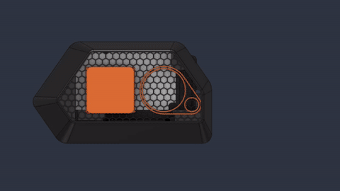

<p align="center">
  
</p>

<h1 align="center">ChonkyFlipper</h1>

<p align="center">
  <strong>Portable IoT Pentesting Framework</strong><br/>
  <sub>Raspberry Pi 4 &middot; Kali Linux ARM64 &middot; WiFi AP + Smartphone Control</sub>
</p>

<p align="center">
  
  
  
  
  
  
</p>

---

A portable penetration testing framework built on Raspberry Pi 4. This headless device creates its own WiFi access point for mobile control via smartphone browser.

## Overview

ChonkyFlipper integrates multiple wireless attack vectors into a compact form factor suitable for IoT security assessments and wireless research. The device operates autonomously without requiring an external display or keyboard.

Key capabilities include WiFi reconnaissance with monitor mode support, Bluetooth LE and Classic scanning with advertisement spoofing, infrared signal capture and replay, sub-1GHz RF analysis (433/868MHz), Zigbee network auditing, NFC/RFID card interaction, and USB HID emulation for physical security testing.

## Architecture

The system uses a three tier architecture: physical hardware layer (GPIO/SPI/I2C modules), REST API backend (Flask), and mobile web frontend. All components communicate over internal buses with the Raspberry Pi acting as the central controller.

## Hardware Stack

### Core Components

* Raspberry Pi 4 Model B (2GB RAM)
* GeeekPi 40mm PWM fan for active cooling
* GPIO stacking header for module expansion
* SunFounder PiPower 5 UPS HAT with 7.4V LiPo battery
* SanDisk 64GB Extreme PRO microSD

### Wireless Modules

* Alfa AWUS036ACS (RTL8811AU) for WiFi analysis
* Internal Pi 4 Bluetooth 5.0 for BLE operations
* SONOFF Zigbee 3.0 USB Dongle (EFR32MG21)
* CC2531 USB Dongle (TI packet sniffer firmware) for Zigbee security auditing
* CC1101 SPI module with SMA antenna (433/868MHz)
* PN532 UART/HSU module for NFC/RFID

### Auxiliary

* KY-005 IR transmitter (GPIO 17)
* KY-022 IR receiver (GPIO 27)
* Mini breadboard with dual voltage rails (5V and 3.3V)

For complete schematics and a detailed GPIO allocation table, see [WIRING.md](WIRING.md).

## Power Design

The PiPower UPS HAT delivers power through the GPIO header pins, leaving the native USB-C port available exclusively for data connections. This enables BadUSB attacks where the device emulates keyboards or storage devices when connected to target computers.

Two separate voltage rails distribute power: 5V for the infrared modules, 3.3V for the CC1101 and PN532 modules. Ground connections are shared across all modules through the breadboard.

## Installation

### Prerequisites

* Kali Linux ARM64 for Raspberry Pi
* Physical hardware assembly completed

### Automated Install

Execute the installation script as root:

```bash
chmod +x install.sh
sudo ./install.sh
```

This creates the directory structure at /opt/chonkyflipper, installs Python dependencies in a virtual environment, configures systemd services, and enables automatic startup.

### Manual Setup

For custom installations or development:

```bash
sudo apt update
sudo apt install python3-pip python3-venv aircrack-ng tcpdump nmap hostapd dnsmasq nginx

pip3 install flask flask-cors gunicorn
```

I2C and SPI are enabled automatically by `install.sh` via `/boot/firmware/config.txt`. No `raspi-config` required.

## Project Structure

```
backend/
    app.py              Flask application entrypoint
    config.py           Centralized paths and constants
    utils.py            API helpers, request validation, SyncTask
    routes/             Flask blueprints (status, wifi, bluetooth, ir,
    |                     subghz, nfc, badusb, zigbee, zigbee_audit, network)
    modules/
        base_db.py      Shared SQLite base class (WAL, schema versioning, sync state)
        base_sync.py    Shared git sync base class (clone, fetch, merge, SHA tracking)
        wifi.py         Alfa adapter + WiFi scanning
        bluetooth/      BLE + Classic BT package (beacons, parsers, module)
        ir/             IR package (module, db, sync, protocols)
        cc1101.py       Sub-1GHz transceiver (SPI)
        pn532.py        NFC/RFID reader/writer (UART/HSU)
        zigbee.py       Zigbee2MQTT bridge (MQTT)
        zigbee_audit.py Zigbee security auditing (CC2531 + KillerBee)
        badusb/         USB HID package (interpreter, keymaps, backends, db, sync, module)
    requirements.txt

frontend/
    index.html          Mobile dashboard shell
    src/
        main.js         App shell: header, sidebar, hash router, theme toggle
        state.js        Central polling store (/status, /system, /network, /version)
        api.js          Fetch wrappers (apiGet / apiPost / apiDelete)
        toast.js        Toast notifications + persistent task handles
        ui.js           Shared presentational fragments (pageHead, card, tabBar, etc.)
        util.js         Escaping + small DOM/format helpers
        style.css       Tailwind entry, chonky / chonky-dark DaisyUI themes
        modules/
            dashboard.js   System overview (temperature, uptime, module status)
            wifi.js        Scan, monitor mode, packet capture, deauth
            bluetooth.js   BLE + Classic scanning, GATT, spoofing, HCI capture
            ir.js          IR library browser (brands/devices/buttons), record/send
            subghz.js      CC1101 record / replay (433/868 MHz)
            nfc.js         PN532 read / write / clone
            badusb.js      DuckyScript payload list + execute
            zigbee.js      Zigbee2MQTT devices, events, bridge info, network map
            zigbee-sniffer.js  CC2531 sniffer: PAN scan, packet capture, key extraction
            settings.js    WiFi connect, network status, power, system update

payloads/
    badusb/             DuckyScript payloads for BadUSB (filesystem browser)

install.sh              Full system setup (run once on fresh Pi)
update.sh               Git pull + deploy (run via dashboard or CLI)
```

## API Reference

### System Endpoints

| Method | Endpoint | Description |
|--------|----------|-------------|
| GET | /api/status | Module availability, power, BadUSB armed state |
| GET | /api/system/info | Temperature and uptime |
| GET | /api/system/version | Git SHA and repo URL |
| POST | /api/system/update | Trigger background update.sh |
| POST | /api/system/poweroff | Shut down the Pi |
| GET | /api/system/power/shutdown-percentage | Read PiPower5 shutdown threshold |
| POST | /api/system/power/shutdown-percentage | Set PiPower5 shutdown threshold |

### Network

| Method | Endpoint | Description |
|--------|----------|-------------|
| GET | /api/network/status | AP, Ethernet, WiFi client, and internet status |
| POST | /api/network/wifi-connect | Connect wlan1 to a WiFi network |
| POST | /api/network/wifi-disconnect | Disconnect wlan1 and remove config |

### WiFi Operations

| Method | Endpoint | Description |
|--------|----------|-------------|
| GET | /api/wifi/scan | Discover access points |
| POST | /api/wifi/start_monitor | Enable monitor mode on wlan1 |
| POST | /api/wifi/stop_monitor | Return wlan1 to managed mode |
| POST | /api/wifi/capture | Record pcap files (duration, channel, filter) |
| POST | /api/wifi/probes | Capture 802.11 probe requests |
| POST | /api/wifi/reset_adapter | Reload rtl8821au driver |
| POST | /api/wifi/audit/wifite-scan | Wifite scan only (no attacks) |
| POST | /api/wifi/audit/wifite-attack | Wifite scan + attack (background) |
| GET | /api/wifi/audit/wifite-status | Check if wifite audit is running |

### Bluetooth

| Method | Endpoint | Description |
|--------|----------|-------------|
| GET | /api/bluetooth/scan | Enumerate BLE devices (accepts `?duration=N`) |
| GET | /api/bluetooth/beacons | Detect iBeacon / Eddystone beacons |
| POST | /api/bluetooth/gatt | Profile GATT services on a BLE device |
| POST | /api/bluetooth/gatt/write | Write to a GATT characteristic |
| POST | /api/bluetooth/capture-hci | Capture raw HCI traffic (btmon, Wireshark pcap) |
| POST | /api/bluetooth/spoof | Start BLE advertisement spoofing |
| POST | /api/bluetooth/spoof/stop | Stop advertisement spoofing |
| GET | /api/bluetooth/spoof/status | Check if spoofing is running |
| POST | /api/bluetooth/deep-scan | Deep BLE scan via bettercap (vendor metadata) |
| GET | /api/bluetooth/classic-scan | Discover Classic BR/EDR devices (hcitool inquiry) |
| POST | /api/bluetooth/sdp | Enumerate SDP services on a Classic device |
| POST | /api/bluetooth/log/start | Start background ad log daemon |
| POST | /api/bluetooth/log/stop | Stop background ad log daemon |
| GET | /api/bluetooth/log/status | Check if ad log daemon is running |
| GET | /api/bluetooth/log/data | Read current ad log daemon data |

### Infrared

| Method | Endpoint | Description |
|--------|----------|-------------|
| POST | /api/ir/record | Capture IR signals |
| POST | /api/ir/transmit | Replay stored signals |
| GET | /api/ir/signals | List recorded signals |
| DELETE | /api/ir/signals/\<signal_id\> | Delete a recorded signal |
| GET | /api/ir/library/brands | Browse IR library brands |
| GET | /api/ir/library/brands/\<slug\>/devices | Devices for a brand |
| GET | /api/ir/library/devices/\<device_id\>/buttons | Buttons for a device |
| POST | /api/ir/library/devices/\<device_id\>/send | Transmit a library button |
| GET | /api/ir/library/search?q=... | Full-text search across brands/devices/buttons |
| POST | /api/ir/sync/check | Check for Flipper-IRDB updates |
| POST | /api/ir/sync/start | Start background IRDB sync |
| GET | /api/ir/sync/status | Sync progress |

### Sub-1GHz RF

| Method | Endpoint | Description |
|--------|----------|-------------|
| POST | /api/subghz/record | Capture at 433/868MHz |
| POST | /api/subghz/transmit | Replay captured signals |
| POST | /api/subghz/scan | Spectrum scan across a frequency range |
| GET | /api/subghz/signals | List saved signals |
| GET | /api/subghz/signals/\<signal_id\> | Get a single signal |
| POST | /api/subghz/decode | Decode signal pulses into protocol data |
| POST | /api/subghz/jam | Jam a frequency for a duration |
| DELETE | /api/subghz/signals/\<signal_id\> | Delete a saved signal |

### NFC/RFID

| Method | Endpoint | Description |
|--------|----------|-------------|
| GET | /api/nfc/read | Detect and read cards |
| POST | /api/nfc/write | Write data to a specific block |
| POST | /api/nfc/dump | Full Mifare Classic 1K dump (default key) |
| POST | /api/nfc/clone | Write a sector dump to a magic card |
| POST | /api/nfc/mfoc | Run mfoc for key recovery and dump |

### BadUSB

| Method | Endpoint | Description |
|--------|----------|-------------|
| GET | /api/badusb/payloads | List filesystem payloads |
| POST | /api/badusb/execute | Execute payload by name, DB id, or inline content |
| GET | /api/badusb/library/os | List OS types with payload counts |
| GET | /api/badusb/library/categories?os={slug} | Categories filtered by OS |
| GET | /api/badusb/library/payloads?os={slug}&category={slug} | Payload list with filters |
| GET | /api/badusb/library/payload/{id} | Single payload with full content |
| GET | /api/badusb/library/search?q=... | Full-text search |
| GET | /api/badusb/library/stats | Payload counts by OS and category |
| POST | /api/badusb/library/sync/check | Check for upstream repo updates |
| POST | /api/badusb/library/sync/start | Clone/update repos and import payloads |
| GET | /api/badusb/library/sync/status | Sync progress |
| POST | /api/badusb/arm | Arm a payload for auto-fire on USB connect |
| GET | /api/badusb/arm/status | Check armed state |
| POST | /api/badusb/arm/cancel | Cancel auto-fire |

### Zigbee Bridge (Zigbee2MQTT)

| Method | Endpoint | Description |
|--------|----------|-------------|
| GET | /api/zigbee/bridge | Bridge info and state |
| GET | /api/zigbee/dashboard | Combined device view (registry + live state) |
| GET | /api/zigbee/events?limit=N | Recent lifecycle and state events |
| GET | /api/zigbee/networkmap | Network topology (nodes + links) |
| POST | /api/zigbee/permit_join | Enable pairing mode |
| POST | /api/zigbee/device/\<name\>/set | Control device (e.g. on/off) |
| POST | /api/zigbee/device/\<name\>/rename | Rename a device |
| DELETE | /api/zigbee/device/\<name\> | Force-remove a device |

### Zigbee Auditing (CC2531 + KillerBee)

| Method | Endpoint | Description |
|--------|----------|-------------|
| POST | /api/zigbee/audit/capture | Capture packets on a channel to pcap |
| POST | /api/zigbee/audit/scan | Passive PAN discovery (zbstumbler) |
| POST | /api/zigbee/audit/discover | Parse pcap for devices (MACs, roles, encryption) |
| POST | /api/zigbee/audit/extract-keys | Extract network keys from capture (zbdsniff) |
| GET | /api/zigbee/audit/captures | List saved pcap capture files |

### Loot (Captured Data)

| Method | Endpoint | Description |
|--------|----------|-------------|
| GET | /api/loot | List captured files by type |
| GET | /api/loot/download?category=\<type\>&name=\<filename\> | Download a captured file |
| DELETE | /api/loot?category=\<type\>&name=\<filename\> | Delete a captured file |

## Usage Workflow

1. Power on the device. The Pi boots and automatically starts the backend API and WiFi access point (SSID: Chonky_Control).

2. Connect a smartphone to the Chonky_Control network.

3. Open a web browser and navigate to http://192.168.4.1 or http://chonkyflipper.pi.

4. Select the desired testing module from the dashboard grid.

5. Execute scans, captures, or replay operations through the interface. Results display in real time within the browser.

All captured data (pcap files, IR signals, RF recordings, card data) stores locally on the device under /opt/chonkyflipper/ for later analysis.

## Security

### Threat model

The Flask API is reachable by anyone connected to the `Chonky_Control` access point (`192.168.4.1`) and by anyone on the LAN the Pi is plugged into. When wlan1 is connected to an untrusted network for internet access, the API is also reachable from that network. The AP itself is the only network-level access control.

### Mitigations in place

- **API token auth**: If `/opt/chonkyflipper/config/api_token` exists, all `/api/` requests must include an `X-API-Token` header. The frontend prompts on 401 and stores the token in localStorage. If no token file exists, auth is disabled (backward compatible).
- **No shell injection**: WiFi module subprocess calls use argv lists (`shell=False`). Route-level validation (`parse_int`/`parse_float` with bounds) prevents non-numeric values from reaching commands.
- **wpa_supplicant escaping**: SSID and passphrase values are escaped via `_escape_wpa_value()` before interpolation into config files.
- **CORS scoped**: CORS is limited to `/api/*` paths. In production, nginx serves the UI same-origin.
- **Debug mode gated**: Flask debug mode is off by default, enabled only via `FLASK_DEBUG=1` env var.

### Known limitations

- **WiFi credentials in plaintext**: `wpa_supplicant-wlan1.conf` stores SSID and password in plaintext (mode `0600`, readable by root and service user). Acceptable for a single-user rig.
- **Per-worker state**: Gunicorn runs with 2 workers; in-memory state (module cache, sync task handles) is per-worker. A status poll may land on a different worker than the one that started a task. Would require an external store (Redis) or single-worker mode to fix.
- **Dependency hygiene**: Flask and flask-cors should be bumped to current patched releases. Werkzeug is not pinned explicitly.

## Enclosure

The custom case was 3D printed to house the Pi, UPS HAT, and all wireless modules in a compact stack. 3D animation of the assembled case:

<p align="center">
  <video src="https://github.com/user-attachments/assets/38f3da91-3b78-46ec-9916-a03bee0d449f" width="480" controls autoplay muted loop playsinline>
    <a href="assets/case-3d-animation.mp4">
      
    </a>
  </video>
</p>

*Full-quality video: [`assets/case-3d-animation.mp4`](assets/case-3d-animation.mp4) — GIF preview autoplays inline; the video above is hosted on GitHub's CDN for native playback.*

Thanks to [IsThisTheCrustyCrab-was-taken](https://github.com/IsThisTheCrustyCrab-was-taken) for help with the case design and 3D printing.

## Development Status

**Completed:** Backend API and core driver implementations (PN532 via libnfc, CC1101 via SpiDev, IR TX/RX via Kernel LIRC), mobile frontend, installation automation, hardware assembly and testing, 3D printed enclosure (see above).

## Disclaimer

This tool is intended solely for authorized security testing and educational purposes. Users must obtain explicit permission before testing any networks or devices they do not own. Compliance with local laws and regulations is the sole responsibility of the operator.

## License

MIT License. See LICENSE file for complete terms.
