# ChonkyFlipper Pinout & Wiring Guide

This document provides a highly visual, easy-to-follow pinout and wiring guide for the ChonkyFlipper mobile auditing rig. It utilizes a Pinout.xyz-style vertical table and a highly structured unified system schematic that mirrors the exact physical wiring of your build.

---

## 1. 40-Pin GPIO Header Reference (Pinout.xyz-Style)

This table mirrors the physical layout of the 40-pin header on your Raspberry Pi 4 (odd pins on the left, even pins on the right).

### Color Key:
* 🔴 **Red (5.0V)** - Power lines (System VCC)
* 🟡 **Yellow (3.3V)** - Power lines (Sensor VCC)
* ⚫ **Black (GND)** - Ground lines
* 🔵 **Blue (Signal)** - SPI, I2C, PWM, or GPIO lines mapped in the backend

| Left Side (Odd Pins) | Pin # | Pin # | Right Side (Even Pins) |
| :--- | :---: | :---: | :--- |
| 🟡 **3.3V Power** (Breadboard Rail) | **1** | **2** | 🔴 **5.0V Power** (Breadboard Rail) |
| 🔵 **GPIO 2** (I2C1 SDA - PN532 SDA) | **3** | **4** | 🔴 **5.0V Power** (Direct to Cooling Fan VCC) |
| 🔵 **GPIO 3** (I2C1 SCL - PN532 SCL) | **5** | **6** | ⚫ **GND** (Breadboard Common GND) |
| GPIO 4 | **7** | **8** | GPIO 14 |
| ⚫ **GND** (Unallocated) | **9** | **10** | GPIO 15 |
| 🔵 **GPIO 17** (LIRC IR-TX - KY-005 DAT) | **11** | **12** | GPIO 18 |
| 🔵 **GPIO 27** (LIRC IR-RX - KY-022 OUT)| **13** | **14** | ⚫ **GND** (Unallocated) |
| GPIO 22 | **15** | **16** | GPIO 23 |
| 🟡 **3.3V Power** (Unallocated) | **17** | **18** | 🔵 **GPIO 24** (CC-GDO2 - CC1101 GD2) |
| 🔵 **GPIO 10** (SPI0 MOSI - CC1101 SI) | **19** | **20** | ⚫ **GND** (Unallocated) |
| 🔵 **GPIO 9** (SPI0 MISO - CC1101 SO) | **21** | **22** | 🔵 **GPIO 25** (CC-GDO0 - CC1101 GD0) |
| 🔵 **GPIO 11** (SPI0 SCLK - CC1101 SCLK)| **23** | **24** | 🔵 **GPIO 8** (SPI0 CE0 - CC1101 CSN) |
| ⚫ **GND** (Unallocated) | **25** | **26** | GPIO 7 |
| GPIO 0 | **27** | **28** | GPIO 1 |
| GPIO 5 | **29** | **30** | ⚫ **GND** (Unallocated) |
| GPIO 6 | **31** | **32** | 🔵 **GPIO 12** (PWM0 - Cooling Fan PWM) |
| GPIO 13 | **33** | **34** | ⚫ **GND** (Direct to Cooling Fan GND) |
| GPIO 19 | **35** | **36** | GPIO 16 |
| GPIO 26 | **37** | **38** | GPIO 20 |
| ⚫ **GND** (Unallocated) | **39** | **40** | GPIO 21 |

---

## 2. Complete, Unified System Schematic (Mermaid.js)

This unified schematic shows all hardware modules connected simultaneously in their exact, factually correct physical wiring:
* **Cooling Fan:** Connected directly to the Pi's GPIO pins (Pins 4, 32, 34). Bypasses the breadboard completely.
* **PN532 (NFC/RFID):** Powered by the 3.3V Breadboard Rail, Ground to the Breadboard GND Rail, and SDA/SCL lines wired directly to the Pi.
* **CC1101 (Sub-GHz):** Powered by the 3.3V Breadboard Rail, Ground to the Breadboard GND Rail, and SPI/GD0/GD2 lines wired directly to the Pi.
* **KY-005 IR Transmitter:** Powered by the 5.0V Breadboard Rail, Ground to the Breadboard GND Rail, and signal line wired to Pin 11.
* **KY-022 IR Receiver:** Powered by the 5.0V Breadboard Rail, Ground to the Breadboard GND Rail, and signal line wired to Pin 13.

```mermaid
graph LR
    %% Raspberry Pi 4 B GPIO Header Block
    subgraph RPi [Raspberry Pi 4 B GPIO Header]
        PIN1[Pin 1: 3.3V OUT]
        PIN2[Pin 2: 5.0V OUT]
        PIN3[Pin 3: GPIO 2 SDA]
        PIN4[Pin 4: 5.0V Fan VCC]
        PIN5[Pin 5: GPIO 3 SCL]
        PIN6[Pin 6: GND Common]
        PIN11[Pin 11: GPIO 17 IR-TX]
        PIN13[Pin 13: GPIO 27 IR-RX]
        PIN18[Pin 18: GPIO 24 GD2]
        PIN19[Pin 19: GPIO 10 MOSI]
        PIN21[Pin 21: GPIO 9 MISO]
        PIN22[Pin 22: GPIO 25 GD0]
        PIN23[Pin 23: GPIO 11 SCLK]
        PIN24[Pin 24: GPIO 8 CSN]
        PIN32[Pin 32: GPIO 12 Fan PWM]
        PIN34[Pin 34: Fan GND]
    end

    %% Mini Breadboard Power Distribution
    subgraph Breadboard [Mini Breadboard Rails]
        VCC3[3.3V Power Rail]
        VCC5[5.0V Power Rail]
        GND[Common GND Rail]
    end

    %% Modules
    subgraph NFC [NFC/RFID - PN532]
        PN_VCC[VCC]
        PN_GND[GND]
        PN_SDA[SDA]
        PN_SCL[SCL]
    end

    subgraph SubGHz [Sub-GHz - CC1101]
        CC_VCC[VCC]
        CC_GND[GND]
        CC_SI[SI]
        CC_SO[SO]
        CC_SCLK[SCLK]
        CC_CS[CSN]
        CC_GD0[GD0]
        CC_GD2[GD2]
    end

    subgraph IR_TX [KY-005 IR Transmitter]
        TX_VCC[VCC]
        TX_GND[GND]
        TX_DAT[DAT]
    end

    subgraph IR_RX [KY-022 IR Receiver]
        RX_VCC[VCC]
        RX_GND[GND]
        RX_OUT[OUT]
    end

    subgraph Cooling [GeeekPi Cooling Fan]
        Fan_VCC[VCC]
        Fan_GND[GND]
        Fan_PWM[PWM]
    end

    %% Power Distribution to Breadboard
    PIN1 --> VCC3
    PIN2 --> VCC5
    PIN6 --> GND

    %% Cooling Fan DIRECT connections (Bypasses Breadboard!)
    PIN4 ===> Fan_VCC
    PIN34 ===> Fan_GND
    PIN32 ===> Fan_PWM

    %% PN532 Connections (Power/GND via Breadboard, Signals from Pi)
    VCC3 ---> PN_VCC
    GND ---> PN_GND
    PIN3 ---> PN_SDA
    PIN5 ---> PN_SCL

    %% CC1101 Connections (Power/GND via Breadboard, Signals from Pi)
    VCC3 ---> CC_VCC
    GND ---> CC_GND
    PIN19 ---> CC_SI
    PIN21 ---> CC_SO
    PIN23 ---> CC_SCLK
    PIN24 ---> CC_CS
    PIN22 ---> CC_GD0
    PIN18 ---> CC_GD2

    %% IR Transmitter Connections (Power/GND via Breadboard, Signal from Pi)
    VCC5 ---> TX_VCC
    GND ---> TX_GND
    PIN11 ---> TX_DAT

    %% IR Receiver Connections (Power/GND via Breadboard, Signal from Pi)
    VCC5 ---> RX_VCC
    GND ---> RX_GND
    PIN13 ---> RX_OUT

    %% Styling
    classDef rpi fill:#e1f5fe,stroke:#01579b,stroke-width:2px,color:#000000;
    classDef board fill:#efebe9,stroke:#3e2723,stroke-width:2px,color:#000000;
    classDef nfc fill:#e8f5e9,stroke:#1b5e20,stroke-width:2px,color:#000000;
    classDef subghz fill:#f3e5f5,stroke:#4a148c,stroke-width:2px,color:#000000;
    classDef ir fill:#ffebee,stroke:#c62828,stroke-width:2px,color:#000000;
    classDef fan fill:#fff3e0,stroke:#e65100,stroke-width:2px,color:#000000;
    
    class RPi,PIN1,PIN2,PIN3,PIN4,PIN5,PIN6,PIN11,PIN13,PIN18,PIN19,PIN21,PIN22,PIN23,PIN24,PIN32,PIN34 rpi;
    class Breadboard,VCC3,VCC5,GND board;
    class NFC,PN_VCC,PN_GND,PN_SDA,PN_SCL nfc;
    class SubGHz,CC_VCC,CC_GND,CC_SI,CC_SO,CC_SCLK,CC_CS,CC_GD0,CC_GD2 subghz;
    class IR_TX,TX_VCC,TX_GND,TX_DAT,IR_RX,RX_VCC,RX_GND,RX_OUT ir;
    class Cooling,Fan_VCC,Fan_GND,Fan_PWM fan;

    style RPi fill:#f5fbfd,stroke:#01579b,stroke-width:1.5px,color:#000000;
    style Breadboard fill:#fbfaf9,stroke:#3e2723,stroke-width:1.5px,color:#000000;
    style NFC fill:#f5faf6,stroke:#1b5e20,stroke-width:1.5px,color:#000000;
    style SubGHz fill:#faf5fc,stroke:#4a148c,stroke-width:1.5px,color:#000000;
    style IR_TX fill:#fff5f5,stroke:#c62828,stroke-width:1.5px,color:#000000;
    style IR_RX fill:#fff5f5,stroke:#c62828,stroke-width:1.5px,color:#000000;
    style Cooling fill:#fffaf5,stroke:#e65100,stroke-width:1.5px,color:#000000;

    %% Custom Link Styling to show wire colors in diagram
    linkStyle 0 stroke:#ffeb3b,stroke-width:2px;
    linkStyle 1 stroke:#ef5350,stroke-width:2px;
    linkStyle 2 stroke:#37474f,stroke-width:2px;
    linkStyle 3 stroke:#ef5350,stroke-width:2px;
    linkStyle 4 stroke:#37474f,stroke-width:2px;
    linkStyle 5 stroke:#2196f3,stroke-width:2px;
    linkStyle 6 stroke:#ffeb3b,stroke-width:2px;
    linkStyle 7 stroke:#37474f,stroke-width:2px;
    linkStyle 8 stroke:#2196f3,stroke-width:2px;
    linkStyle 9 stroke:#4caf50,stroke-width:2px;
    linkStyle 10 stroke:#ffeb3b,stroke-width:2px;
    linkStyle 11 stroke:#37474f,stroke-width:2px;
    linkStyle 12 stroke:#2196f3,stroke-width:2px;
    linkStyle 13 stroke:#4caf50,stroke-width:2px;
    linkStyle 14 stroke:#ff9800,stroke-width:2px;
    linkStyle 15 stroke:#cfd8dc,stroke-width:2px;
    linkStyle 16 stroke:#8d6e63,stroke-width:2px;
    linkStyle 17 stroke:#9c27b0,stroke-width:2px;
    linkStyle 18 stroke:#ef5350,stroke-width:2px;
    linkStyle 19 stroke:#37474f,stroke-width:2px;
    linkStyle 20 stroke:#ff9800,stroke-width:2px;
    linkStyle 21 stroke:#ef5350,stroke-width:2px;
    linkStyle 22 stroke:#37474f,stroke-width:2px;
    linkStyle 23 stroke:#4caf50,stroke-width:2px;
```



---

## 3. GPIO Pinout Allocation Table

| Physical Pin | BCM GPIO | Type | Function | Connected To | Rail Used |
|--------------|----------|------|----------|--------------|-----------|
| **Pin 1** | - | Power | 3.3V Power Out | Mini Breadboard 3.3V Rail | 3.3V Rail |
| **Pin 2** | - | Power | 5.0V Power Out | Mini Breadboard 5.0V Rail | 5.0V Rail |
| **Pin 3** | GPIO 2 | I2C1 | SDA (Data) | PN532 SDA Pin | Direct Pi Pin |
| **Pin 4** | - | Power | 5.0V Power Out | Connected directly to Fan VCC | Direct Pi Pin |
| **Pin 5** | GPIO 3 | I2C1 | SCL (Clock) | PN532 SCL Pin | Direct Pi Pin |
| **Pin 6** | - | GND | Ground | Mini Breadboard Common GND Rail | GND Rail |
| **Pin 11** | GPIO 17 | Output | IR-TX Signal | KY-005 DAT Pin | Direct Pi Pin |
| **Pin 13** | GPIO 27 | Input | IR-RX Signal | KY-022 OUT Pin | Direct Pi Pin |
| **Pin 18** | GPIO 24 | Input | CC1101 GDO2 | CC1101 GD2 Pin (Interrupt) | Direct Pi Pin |
| **Pin 19** | GPIO 10 | SPI0 | MOSI (Master Out) | CC1101 SI Pin | Direct Pi Pin |
| **Pin 21** | GPIO 9 | SPI0 | MISO (Master In) | CC1101 SO Pin | Direct Pi Pin |
| **Pin 22** | GPIO 25 | Input | CC1101 GDO0 | CC1101 GD0 Pin (Async Clock/Data) | Direct Pi Pin |
| **Pin 23** | GPIO 11 | SPI0 | SCLK (Clock) | CC1101 SCLK Pin | Direct Pi Pin |
| **Pin 24** | GPIO 8 | SPI0 | CE0 (Chip Select) | CC1101 CSN Pin | Direct Pi Pin |
| **Pin 32** | GPIO 12 | PWM0 | PWM Fan Signal | Connected directly to Fan PWM | Direct Pi Pin |
| **Pin 34** | - | GND | Ground | Connected directly to Fan GND | Direct Pi Pin |

*Note: All unlisted pins (e.g. GND Pins 9, 14, 20, 25, 30, 39) are unallocated and free for future stacking expansions.*

---

## 4. Power Distribution Strategy
The SunFounder PiPower 5 UPS HAT supplies system-wide 5V power over the stacking GPIO header. To prevent power drops and signal noise:
1. **The Shared Ground Rule:** Terminate the ground wire of the Raspberry Pi (Pin 6) and all four breadboard peripherals (PN532, CC1101, KY-005, KY-022) on the single Common GND Rail on your mini-breadboard.
2. **Voltage Partitioning:**
   * **3.3V Rail (Breadboard):** Fed by Pi Pin 1. Only connect the CC1101 and PN532 here.
   * **5.0V Rail (Breadboard):** Fed by Pi Pin 2. Connect the KY-005 and KY-022 here.
3. **Direct Connections:** The Cooling Fan has its own dedicated direct paths to Pins 4, 32, and 34 to keep high-frequency PWM switching noise completely off the breadboard power rails.

---

## 5. Hardware Verification Commands

Verify that your physical connections are perfectly wired by running these commands on the Pi:

```bash
# 1. Verify RFID/NFC PN532 (must list '24' on the I2C bus)
sudo i2cdetect -y 1

# 2. Verify CC1101 (must show spidev0.0)
ls -la /dev/spidev*

# 3. Verify IR Transmitter & Receiver LIRC modules (must show lirc0, lirc1, lirc2)
ls -la /dev/lirc*

# 4. Read temperature & ensure fan driver is active
cat /sys/class/thermal/cooling_device0/type
vcgencmd measure_temp
```
